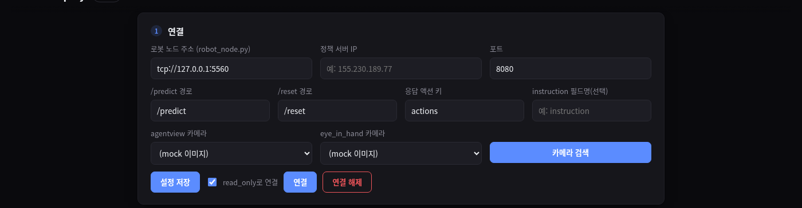
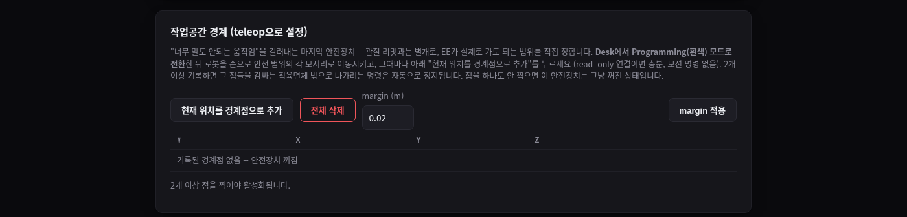
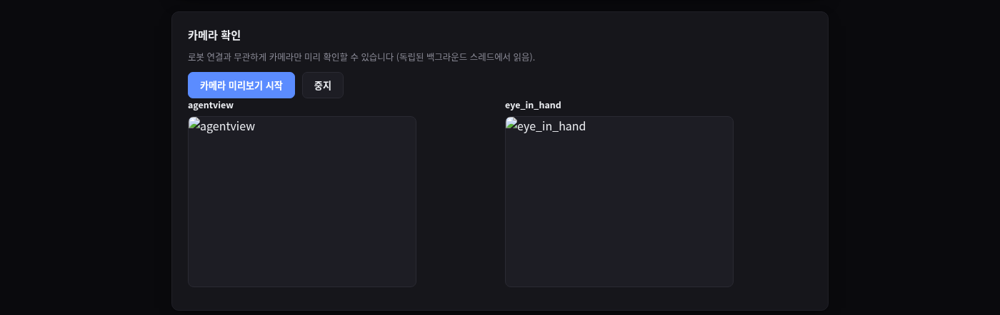
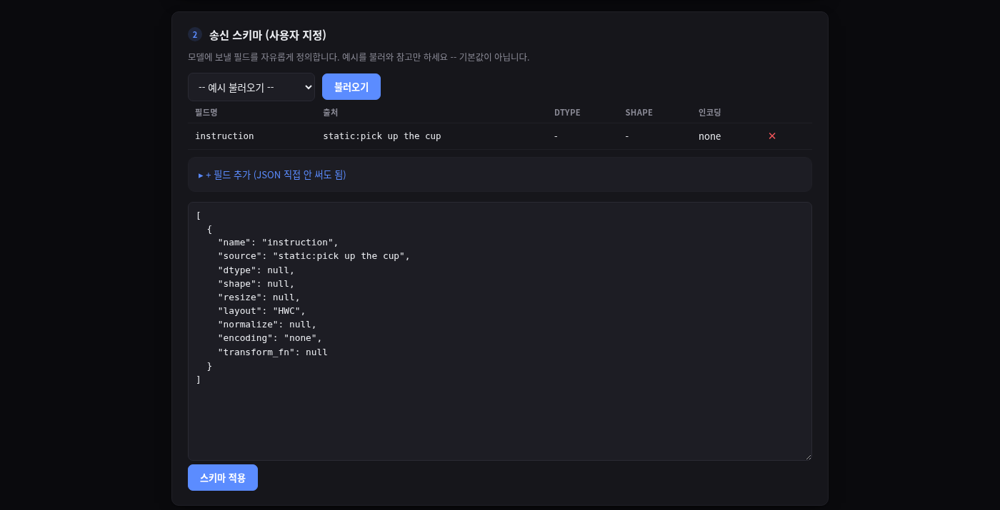
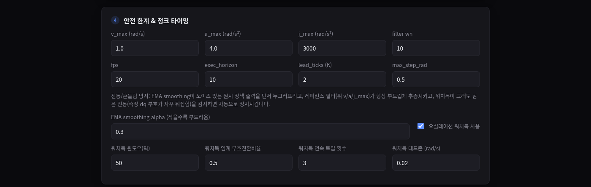

# franka-deploy 대시보드 가이드

각 설정 화면 스크린샷과 함께, 필드가 무슨 뜻인지 + 어떤 순서로 실행하는지 정리한 문서.
스크린샷은 `docs/screenshots/`에 있고, 아래 각 섹션에 대응됨.

## 실행 방법

바탕화면 아이콘(**franka-deploy**)을 더블클릭하면 아래 두 프로세스를 (이미 떠 있지
않은 것만) 띄우고 브라우저로 대시보드를 연다 — `run_franka_deploy.sh` 참고.

franka-deploy는 **로봇 제어와 웹서버를 서로 다른 프로세스**로 분리해서 돌린다 (IK 계산
같은 무거운 파이썬 작업이 로봇의 1kHz 제어 스레드와 같은 GIL을 공유하면 실제로 리플렉스
크래시가 났던 적이 있어서 — `README.md`의 "Architecture" 섹션 참고). 수동으로 띄우려면:

```bash
# 1) 로봇 노드 -- FR3Runtime + 1kHz 제어만 전담. 로봇에 실제로 붙기 전까진 아무 것도 안 함.
~/pylibfranka-venv/bin/python -m franka_deploy.robot.robot_node --robot-ip 172.16.0.2 --port 5560

# 2) 앱 서버 -- 웹 대시보드, 정책 서버 통신, IK, 카메라.
~/pylibfranka-venv/bin/uvicorn franka_deploy.api.main:app --host 0.0.0.0 --port 8000
```

브라우저에서 `http://<이 머신 IP>:8000/` 접속. **주의: 앱 서버를 재시작하면 대시보드에
입력해둔 설정(연결 정보, 스키마 등)이 전부 초기화된다** — 서버 프로세스 메모리에만
있고 디스크에 저장되지 않기 때문(단, **작업공간 경계점은 예외** — 별도로 유지됨, 아래
2번 패널 참고). 재시작 후엔 설정을 다시 입력하고 **반드시 "설정 저장" 버튼을 눌러야**
서버에 반영된다 (아래 1번 패널 참고).

---

## 1. 연결 패널



| 필드 | 의미 |
|---|---|
| 로봇 노드 주소 | 위 1번 프로세스(`robot_node.py`)의 ZMQ 주소. **로봇의 FCI IP(`172.16.0.2`)가 아니다** — 그건 robot_node.py 실행할 때 `--robot-ip`로 따로 준다. 로컬에서 같이 돌리면 기본값 `tcp://127.0.0.1:5560` 그대로 두면 됨. |
| 정책 서버 IP / 포트 | VLA/RL 모델이 떠 있는 서버 주소. **앱 서버 프로세스가** 여기로 HTTP 요청을 보내는 거라, 브라우저가 아니라 앱 서버 기준으로 도달 가능한 주소여야 함(같은 머신이면 `127.0.0.1`). |
| /predict, /reset 경로 | 정책 서버의 엔드포인트 경로. 서버 구현에 맞춰 바꾸면 됨. |
| 응답 액션 키 | `/predict` 응답 JSON에서 액션 청크가 들어있는 키 이름. 예: `{"actions": [[...]]}`이면 `actions`. |
| instruction 필드명 | `/reset` 요청에 지시문(예: "pick up the cup")을 실어 보낼 때 그 필드 이름. 안 쓰면 비워둠. |
| agentview / eye_in_hand 카메라 | 드롭다운 — 페이지 열면 자동으로 연결된 RealSense 카메라를 스캔해서 보여줌. 시리얼 고르면 그 카메라를 쓰고, `(mock 이미지)`를 고르면 카메라 없이 랜덤 이미지로 대체(하드웨어 없이 테스트할 때 유용). "카메라 검색" 버튼으로 다시 스캔 가능. |
| **설정 저장** | **여기 입력한 모든 값(연결 정보 + 스키마 + 안전 한계까지 전부)을 서버에 실제로 반영하는 버튼.** 이거 안 누르면 드롭다운/입력칸에 뭘 골라도 서버는 모른다 — 가장 자주 하는 실수. |
| read_only로 연결 | 체크돼 있으면 로봇에 연결은 하되 **모션 명령을 절대 보내지 않음**. 처음엔 항상 체크한 채로 연결해서 상태 스트리밍만 확인하는 게 원칙. |
| 연결 / 연결 해제 | 연결은 로봇 노드에 붙어서 세션 시작. **설정을 바꾸려면 먼저 "연결 해제"를 눌러야** 한다 — 세션이 살아있는 동안은 `/api/config`가 409로 막힘. |

---

## 2. 작업공간 경계 패널 (teleop으로 설정)



관절 리밋이나 레퍼런스 필터와는 별개의, **마지막 안전장치**. "말도 안 되는 움직임"
(관절 제한 안, 부드럽긴 한데 엉뚱한 곳으로 가는 경우)을 막으려고, EE가 실제로 가도
되는 범위를 사람이 직접 정한다.

1. `read_only`로 **연결** (모션 명령 없이 상태만 읽으면 되므로 이걸로 충분)
2. Desk에서 로봇을 **Programming(흰색) 모드**로 전환 ([[franka-hand-guiding]] 참고 —
   Execution/파란색 모드에선 손으로 못 움직임)
3. 로봇을 손으로 잡고 원하는 안전 범위의 한쪽 모서리로 이동 → **"현재 위치를 경계점으로
   추가"** 클릭
4. 반대쪽 모서리(대각선 반대편)로 이동 → 다시 클릭. **2개면 충분** (그 두 점을 감싸는
   직육면체가 범위가 됨) — 더 정교하게 하고 싶으면 점을 더 찍어도 되고, 그러면 모든
   점을 감싸는 가장 작은 직육면체로 계산됨.
5. `margin`은 계산된 상자를 안쪽으로 줄이는 여유값(m) — 기본 0.02m.

**2개 이상 점이 찍히는 순간부터 자동으로 활성화**된다. 그 뒤로는 실제 모션 중 매 틱,
① 다음에 보낼 목표의 EE 위치와 ② 현재 측정된 EE 위치를 둘 다 이 상자와 비교해서, 하나라도
벗어나면 즉시 정지(다른 안전장치와 동일하게 `ERROR` 상태로 멈추고 원인이 텔레메트리에
찍힘). 점을 하나도 안 찍으면 이 검사는 그냥 꺼진 상태 — 필수는 아니지만 새 정책/새
스키마 처음 테스트할 때는 찍어두는 걸 권장.

이 경계점들은 **`/api/config`나 서버 재시작과 무관하게 별도로 유지**된다 (연결
해제해도 안 지워짐) — 로봇 팔 주변 환경은 세션이 아니라 이 물리적 설치에 대한
사실이라서. 지우려면 "전체 삭제" 또는 각 행의 ✕ 버튼.

---

## 3. 카메라 확인 패널



로봇 연결과 완전히 무관하게 카메라만 독립적으로 확인할 수 있는 패널. 내부적으로
카메라마다 전용 백그라운드 스레드가 계속 프레임을 읽어두고 있어서(`cameras/manager.py`),
"카메라 미리보기 시작"을 누르면 0.5초마다 최신 프레임을 가져와 보여준다.

- **먼저 1번 패널에서 "설정 저장"을 눌러야** 여기서 카메라를 열 수 있다 (서버가 어떤
  카메라를 열지 모르면 시작 자체가 실패함).
- RealSense는 한 번에 한 프로세스만 스트림을 열 수 있다. manipulation-stack 수집기
  GUI 같은 다른 프로그램이 이미 카메라를 쓰고 있으면 "camera open failed -- is
  another app already using it?" 에러가 뜬다 — 그 프로그램을 먼저 닫아야 함.

---

## 4. 송신 스키마 패널



정책 서버(모델)에 무엇을 어떤 형식으로 보낼지 **사용자가 직접 정의**하는 곳 — 이
프로젝트의 핵심. 특정 모델 프로토콜에 종속되지 않으려고 만든 부분.

- **예시 불러오기**: 미리 저장된 스키마 예시(`franka_deploy/configs/examples/`)를
  불러와 참고할 수 있다. 기본값이 아니라 그냥 템플릿이므로 항상 확인하고 고쳐 쓸 것.
- **필드 요약 테이블**: 지금 스키마에 어떤 필드가 있는지(필드명/출처/dtype/shape/인코딩)
  한눈에 보여줌. 각 행 끝의 ✕ 버튼으로 필드 삭제 가능.
- **"+ 필드 추가"**: JSON을 직접 안 쳐도 필드를 추가할 수 있는 폼.
  - **출처(source)**: 이 값이 어디서 오는지. `camera:agentview`, `camera:eye_in_hand`
    (카메라 프레임) / `robot:joint_positions`, `robot:ee_pos`, `robot:ee_pos_quat` 등
    (현재 로봇 상태) / `static:아무값` (고정 텍스트/값) / `custom:user_plugins.함수명`
    (직접 짠 파이썬 함수 — language embedding처럼 자동으로 만들 수 없는 값에 사용,
    `~/franka-deploy/user_plugins.py`에 함수 작성).
  - **dtype/shape/resize/layout/normalize/인코딩**: 이미지나 숫자 배열을 모델이
    원하는 형태(예: float32 `[1,1,3,128,128]`, CHW, base64 PNG 등)로 변환하는 옵션.
    안 건드리면 원본 그대로 나감.
- **텍스트 에디터**: 위 폼으로 만든 JSON이 그대로 여기 나타나고, 직접 편집도 가능
  (둘이 서로 실시간 반영됨). 다 되면 **"스키마 적용"** 클릭 → 1번 패널의 "설정 저장"과
  함께 최종 저장됨.

---

## 5. 응답 포맷 감지 & 확인 패널


정책 서버가 관절 절대값/EE 절대값/그 델타값 중 뭘 돌려주는지 **자동으로 감지**하는
단계. 로봇에 연결(`connected` 상태)된 뒤에만 누를 수 있고, `/reset`+`/predict`를
딱 한 번 호출할 뿐 **모션은 절대 안 나간다.**

- **reset instruction**: `/reset`에 실어 보낼 지시문 (1번 패널에서 instruction
  필드명을 설정했을 때만 의미 있음).
- **감지 실행** 누르면: 감지된 액션 스페이스(joint_absolute/joint_delta/ee_absolute/
  ee_delta), 차원, 그리퍼 컨벤션, 회전 표현, 확신도, 실제 받은 응답 샘플 값이 표로
  나타남. **정규화된(예: -1~1) 델타 신호는 자동감지가 잘 못 맞출 수 있다** — 그럴 땐
  나온 폼을 직접 고쳐서(액션 스페이스/그리퍼/회전표현/delta scale) **"이대로 확정"**을
  누르면 됨. 확정 전까지는 여전히 모션 없음.

---

## 6. 안전 한계 & 청크 타이밍 패널



| 필드 | 의미 |
|---|---|
| v_max / a_max / j_max | 관절 속도/가속도/저크 상한 (rad/s, rad/s², rad/s³). 정책이 아무리 이상한 값을 보내도 로봇 노드의 레퍼런스 필터가 이 안으로 클램프해서 보냄 — 오감지·오작동에도 급격한 동작은 안 나오게 하는 핵심 안전장치. 기본값(1.0 / 4.0 / 3000)은 이 로봇에서 실기 검증된 값. |
| filter wn | 레퍼런스 필터의 반응 속도(자연주파수). 높을수록 목표를 더 빨리 쫓아가고, 낮을수록 부드러움. |
| fps | 정책 루프 주기 (Hz). 서버에 얼마나 자주 관측을 보내고 액션을 받을지. |
| exec_horizon | 서버가 한 번에 돌려주는 액션 청크 중 실제로 쓰는 개수. |
| lead_ticks (K) | 청크 끝나기 K틱 전에 다음 추론을 미리 요청해서 경계에서 로봇이 멈추지 않게 하는 값 (자세한 원리는 README/메모리의 "청크 경계 정지" 참고). |
| max_step_rad | 한 틱에 "목표값-측정값"이 벌어질 수 있는 최대치. 정책 명령이 실측보다 얼마나 앞서나갈 수 있는지의 상한이지, 속도 제한 자체는 아님(그건 v_max가 함). |
| EMA smoothing alpha | 원시 정책 출력을 레퍼런스 필터에 넣기 **전에** 먼저 누그러뜨리는 정도. 작을수록 부드럽고 반응은 느려짐. |
| 오실레이션 워치독 | 그래도 남은 진동(측정 속도 dq의 부호가 자꾸 뒤집힘)을 감지하면 자동 정지시키는 마지막 방어선. 윈도우(틱 수)/임계 부호전환비율/연속 트립 횟수/데드존으로 민감도 조절 가능. |

진동/흔들림 방지는 이 세 겹(EMA → 레퍼런스 필터 → 워치독)이 하고, "말도 안 되는
곳으로 가는" 문제는 위 2번 작업공간 경계 패널이 담당 — 둘은 서로 다른 종류의 문제라
따로 뒀다.

---

## 7. 실행 패널


- **Start**: 실제로 로봇에 모션 명령을 보내기 시작. **감지 → 확정까지 끝난(`armed`)
  상태에서만 가능.** 한 번 Stop한 뒤 다시 Start를 눌러도(재감지 없이) 그대로 재개됨.
- **Stop**: 감속 정지 — 레퍼런스 필터의 한계 안에서 부드럽게 멈춤.
- **E-STOP**: 로봇 노드까지 즉시 정지.

---

## 8. 텔레메트리


WebSocket으로 0.1초마다 갱신되는 실시간 상태를 카드형 숫자로 보여준다 (상태/제어
성공률/정책 지연/재계획 횟수/예산 초과/최대 |dq|/EE 위치, 값에 따라 초록·주황·빨강으로
자동 색상). 원본 JSON 전체가 필요하면 "원본 JSON 보기"를 펼치면 된다 — `error` 필드에
크래시/정지 원인 메시지(오실레이션 워치독, 작업공간 경계 이탈 등)가 그대로 찍힌다.
문제 생기면 제일 먼저 볼 곳.

---

## 전체 실행 순서 요약

1. 바탕화면 아이콘으로 로봇 노드 + 앱 서버 실행
2. 대시보드 접속 → 1번 패널 값 입력 → 4번(스키마) 작성 → 6번(안전 한계, 보통 기본값) →
   **"설정 저장" 클릭 (제일 중요, 자주 빼먹음)**
3. `read_only` 체크된 채로 **연결**
4. (권장, 새 환경/새 정책 처음 테스트할 때) 2번 작업공간 경계 패널에서 Programming
   모드로 전환 후 안전 범위 경계점 2개 이상 기록
5. (선택) 카메라 확인
6. **감지 실행** → 결과 확인/필요시 직접 수정 → **이대로 확정**
7. **Start** — 실제 모션 시작. 문제 생기면 Stop 또는 E-STOP.
8. 설정을 다시 바꾸려면 **연결 해제**부터 (작업공간 경계점은 안 지워짐).

## 자주 나는 에러

| 에러 메시지 | 원인 |
|---|---|
| `no request_spec configured` | 설정 저장을 안 눌렀음 |
| `call /connect first` | 연결을 안 한 채로 감지/경계점 추가를 눌렀음 |
| `call /detect then /confirm first (state=...)` | armed/stopped가 아닌 상태에서 Start를 눌렀음 (감지→확정 먼저) |
| `stop the running session before changing config` | 세션이 살아있는 채로 설정을 바꾸려 함 → 연결 해제 먼저 |
| `camera open failed -- is another app already using it?` | 다른 프로그램이 카메라를 이미 열고 있음 |
| `did not respond within Nms ... is robot_node.py running?` | 로봇 노드 프로세스가 안 떠 있거나 주소가 틀림 |
| 텔레메트리 `error`에 `EE position ... outside recorded workspace bounds ...` | 작업공간 경계 밖으로 나가려는 명령이 감지돼 자동 정지됨 — 의도한 범위가 맞는지, 아니면 정책 자체가 이상한 값을 내는지 확인 |
